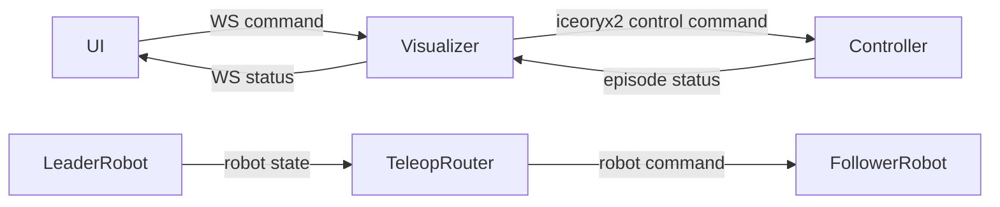

# Sprint 3 -- Teleop Router + Episode Lifecycle

## Outcome
- Deliver the Sprint 3 checkpoint from [implementation-plan.md](implementation-plan.md): `rollio collect` launches a leader/follower pseudo-robot setup with 2 cameras, the follower mirrors the leader live, and the UI supports `start -> stop -> keep/discard` transitions with an episode counter and timer. Recording, encoding, storage, and dataset output remain out of scope until later sprints.
- Treat Sprint 3 as the first point where the upstream collection data stream is meaningfully complete on `iceoryx2`: a lightweight listener should be able to observe timestamped camera traffic, robot state, follower commands, and episode lifecycle events well enough to manually assess correctness. This is not the final recorder format or performance path, but it should be sufficient to inspect action lag, camera cadence, and FPS stability before Sprint 4-5 add real recording.
- Assumption: include Cartesian forwarding in scope because it is explicitly listed in [implementation-plan.md](implementation-plan.md) tests, but implement it after the direct-joint path so the team can reach the checkpoint early.

## Architecture Slice

## Existing Leverage
- Extend [`controller/src/collect.rs`](../controller/src/collect.rs): `build_collect_specs()` already spawns `visualizer`, device drivers, and `ui`, but not a Teleop Router or any episode-control loop.
- Replace the stub at [`teleop-router/src/main.rs`](../teleop-router/src/main.rs) with the first real Teleop Router implementation.
- Extend [`ui/terminal/src/App.tsx`](../ui/terminal/src/App.tsx): the status bar is still hardcoded with `state="Idle"` and `episodeCount={0}`.
- Extend [`visualizer/src/websocket.rs`](../visualizer/src/websocket.rs) and [`visualizer/src/protocol.rs`](../visualizer/src/protocol.rs): only `get_stream_info` and `set_preview_size` are supported today.
- Expand [`rollio-types/src/config.rs`](../rollio-types/src/config.rs): `PairConfig` only contains `leader`, `follower`, and `mapping`, while Sprint 3 needs direct-joint remap/scaling config; `UiRuntimeConfig` only contains `websocket_url` even though Sprint 3 calls for configurable keys.
- Reuse timestamps already present in [`rollio-types/src/messages.rs`](../rollio-types/src/messages.rs): camera headers, `RobotState`, and `RobotCommand` should be treated as the basis for Sprint 3 manual bus-level correctness checks.
- Keep the design aligned with [components.md](components.md): the Teleop Router remains a pure message transformer with no embedded kinematic knowledge.

## Workstreams

### 1. Shared Schema And IPC Contract
- Extend [`rollio-types/src/config.rs`](../rollio-types/src/config.rs) so teleop pairs can describe the full runtime mapping needed by [components.md](components.md): mapping mode, optional joint index map, and optional scaling factors.
- Add the minimum shared message types in [`rollio-types/src/messages.rs`](../rollio-types/src/messages.rs) for the missing control/status bridge: one UI-originated episode command payload and one controller-to-UI episode status payload. Keep existing `ControlEvent::{RecordingStart, RecordingStop, EpisodeKeep, EpisodeDiscard, Shutdown}` as the module-facing lifecycle events.
- Confirm the bus-visible data needed for later recording is present now: timestamped camera frames, leader robot state, follower robot commands, and episode lifecycle events should all be observable by a standalone listener. Only extend shared messages if the current timestamps/indices are not sufficient to validate lag and cadence manually.
- Update [`config/config.example.toml`](../config/config.example.toml) and the hardware-oriented examples so the intended Sprint 3 teleop pair and any UI keybinding config are explicit.

### 2. Teleop Router Implementation
- Turn [`teleop-router/src/main.rs`](../teleop-router/src/main.rs) into a thin CLI over reusable router logic so tests can target the routing code directly.
- Subscribe to the leader robot's state topic, translate the message according to mapping mode, publish `RobotCommand` to the follower command topic, and exit promptly on shutdown.
- Implement direct-joint identity/remap/scaling first, then Cartesian forwarding by copying `RobotState.ee_pose` into a `RobotCommand` with Cartesian mode.
- Add focused tests under the teleop-router crate for identity mapping, reverse remap, scaling factors, Cartesian forwarding, shutdown, and the latency budget from [implementation-plan.md](implementation-plan.md).

### 3. Controller Episode Lifecycle And Process Orchestration
- Refactor [`controller/src/collect.rs`](../controller/src/collect.rs) so process launching and runtime control loops are separate concerns; this avoids burying episode logic inside the one-shot child-spawn path.
- Add the `Idle -> Recording -> Pending -> Idle` state machine, episode counter, and elapsed-time tracking in the controller layer.
- Spawn one Teleop Router child per `[[pairing]]` entry and pass inline TOML derived from the top-level config.
- Receive episode commands from the Visualizer bridge, validate transitions, publish lifecycle `ControlEvent`s, and publish status snapshots for the UI.
- Preserve current shutdown behavior: signals or child failure should still trigger a clean `Shutdown` broadcast and child teardown.

### 4. Visualizer Control And Status Bridge
- Extend [`visualizer/src/ipc.rs`](../visualizer/src/ipc.rs) to subscribe/publish the new controller IPC channels in addition to the existing robot/camera subscriptions.
- Extend [`visualizer/src/protocol.rs`](../visualizer/src/protocol.rs) and [`visualizer/src/websocket.rs`](../visualizer/src/websocket.rs) so WebSocket commands include `episode_start`, `episode_stop`, `episode_keep`, and `episode_discard`, and so episode status is sent back to the UI as JSON.
- Keep the preview pipeline unchanged apart from the extra control/status messages.

### 5. Terminal UI Status And Keyboard Control
- Extend [`ui/terminal/src/lib/protocol.ts`](../ui/terminal/src/lib/protocol.ts) and [`ui/terminal/src/lib/websocket.ts`](../ui/terminal/src/lib/websocket.ts) to send episode commands and consume episode-status messages.
- Replace the hardcoded status props in [`ui/terminal/src/App.tsx`](../ui/terminal/src/App.tsx) and [`ui/terminal/src/components/StatusBar.tsx`](../ui/terminal/src/components/StatusBar.tsx) with live state, episode count, elapsed time, and pending keep/discard affordances.
- Add configurable bindings for start/stop/keep/discard while preserving the existing `d` and `r` shortcuts; document sensible defaults in config examples.
- Add focused UI tests for status rendering and for keypress-to-command behavior.

### 6. Manual Validation Support
- Treat Sprint 3 as the point where a naive `iceoryx2` tap can observe the essential collection stream, even though no formal recorder exists yet.
- Define a small manual-test listener recipe around the relevant topics: leader `robot/{name}/state`, follower `robot/{name}/command`, camera `camera/{name}/frames` headers, and `control/events`.
- Use that listener during manual testing to capture timestamps and episode indices, then verify action lag, monotonic timestamps, camera FPS near config, and obvious jitter/instability.
- Keep this lightweight: the tool can emit logs or CSV-like output for inspection, but it does not need to match the final dataset layout or throughput characteristics of Sprint 4-5 components.

## Verification Gates
- Match the Sprint 3 unit coverage in [implementation-plan.md](implementation-plan.md): Teleop Router mapping/remap/scaling, Cartesian forwarding, latency, shutdown, controller transitions, event publishing, Visualizer round-trip, and UI status rendering.
- Add a pseudo-device smoke flow matching the checkpoint: leader pseudo robot in free-drive, follower pseudo robot in command-following, 2 pseudo cameras, `rollio collect`, follower mirrors leader, `start/stop/keep/discard` all update the status bar and episode count correctly.
- Add an explicit manual bus-listener check: subscribe to the relevant `iceoryx2` topics during the pseudo-device smoke flow and confirm that the stream is complete enough to reconstruct a rough episode trace, including camera timestamps/frame cadence, leader state, follower command timing, and lifecycle events.
- In that manual check, verify the concrete correctness questions called out for Sprint 3: are follower actions lagging behind the leader, are camera frames arriving too slowly, and is effective FPS stable enough around the configured target.
- Explicitly verify that Sprint 3 still saves nothing to disk; encoder, assembler, and storage remain inactive for this sprint.

## Risks To Front-Load
- `PairConfig` does not currently encode remap/scaling, so schema work is a prerequisite, not a follow-up.
- The bus currently exposes `control/events` but no dedicated episode-status channel, so the IPC contract should be settled before UI and Visualizer work proceed in parallel.
- The UI already uses `d` and `r`, so the configurable episode keys need defaults that avoid collisions.
- Teleop behavior must be validated on the bus, not just in the TUI, otherwise Sprint 3 can appear complete while still hiding lag or unstable timing in the collection stream.
