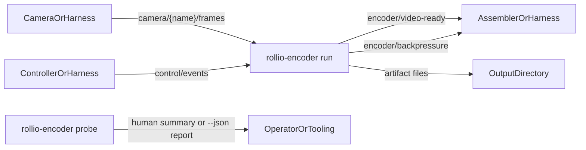

# Sprint 4 Part A -- Standalone Encoder Slice

## Outcome

- Deliver the standalone encoder slice from Sprint 4 before Sprint 3 UI and
  controller lifecycle integration.
- Keep the scope centered on the encoder binary itself: `probe`, `run`,
  capability reporting, bounded queue handling, artifact writing, and
  round-trip validation.
- Support color-video codecs `h264`, `h265`, and `av1` through native `libav`
  bindings with CPU as the mandatory path and NVIDIA / VAAPI as
  capability-gated hardware paths when the host exposes those backends.
- Use [`third_party/rvl-rust`](../third_party/rvl-rust/README.md) as the sole
  one-channel lossless backend for `depth16` streams. `ffv1` is explicitly
  deferred for now.
- Treat performance and resource-consumption output as report-only benchmark
  data, not as hard pass/fail gates.
- Defer `rollio collect` integration, Controller spawning, UI-triggered episode
  control, and Episode Assembler / Storage follow-on work to later Sprint 4
  Part B or Sprint 5 work.

## Existing Leverage

- Reuse the Sprint 4 module contract already described in
  [`implementation-plan.md`](implementation-plan.md) and
  [`components.md`](components.md): the encoder listens to raw camera frames and
  `control/events`, writes artifacts on `recording_start` / `recording_stop`,
  and emits `video_ready` and `backpressure`.
- Reuse the shared IPC and lifecycle types already defined in
  [`rollio-types/src/messages.rs`](../rollio-types/src/messages.rs), especially
  `CameraFrameHeader`, `ControlEvent`, `VideoReady`, and
  `BackpressureEvent`.
- Reuse the shared config surface in
  [`rollio-types/src/config.rs`](../rollio-types/src/config.rs) and extend it
  for encoder-runtime-specific config rather than inventing a separate
  argument-only contract.
- Reuse the topic naming helpers in
  [`rollio-bus/src/lib.rs`](../rollio-bus/src/lib.rs) and
  [`cpp/common/include/rollio/topic_names.hpp`](../cpp/common/include/rollio/topic_names.hpp)
  so the encoder can publish standardized `video_ready` and `backpressure`
  services.
- Reuse the RVL depth codec in
  [`third_party/rvl-rust/src/lib.rs`](../third_party/rvl-rust/src/lib.rs),
  including its `DepthEncoder` / `DepthDecoder` façade and its existing
  recorded/live efficiency-reporting tests.
- Reuse the synthetic publish and process-spawn test patterns already present
  in [`test/test-publisher/src/main.rs`](../test/test-publisher/src/main.rs),
  [`cameras/v4l2/tests/cli.rs`](../cameras/v4l2/tests/cli.rs), and
  [`robots/pseudo/tests/runtime.rs`](../robots/pseudo/tests/runtime.rs).

## Runtime Shape

## Workstreams

## 1. Runtime Contract And IPC Surface

- Add an encoder-specific runtime config in
  [`rollio-types/src/config.rs`](../rollio-types/src/config.rs) with the fields
  needed for standalone operation:
  `process_id`, `camera_name` or explicit `frame_topic`, `output_dir`,
  `codec`, `backend`, `artifact_format`, `queue_size`, and nominal `fps`.
- Keep top-level shared encoder config in the same file so Controller can reuse
  the codec/backend defaults later rather than maintaining a second schema.
- Model encoder capabilities explicitly in config/types:
  codec, implementation family (`libav` or `rvl`), direction (`encode` or
  `decode`), backend (`cpu`, `nvidia`, `vaapi`), pixel formats, and artifact
  formats.
- Extend shared service names in
  [`rollio-bus/src/lib.rs`](../rollio-bus/src/lib.rs) and
  [`cpp/common/include/rollio/topic_names.hpp`](../cpp/common/include/rollio/topic_names.hpp)
  for:
  - `encoder/video-ready`
  - `encoder/backpressure`
- Keep `VideoReady.file_path` as the Part A artifact handoff contract even for
  RVL output files. More expressive artifact typing can be revisited in later
  assembly/storage work.

## 2. Native Media Layer

- Replace the current encoder stub at
  [`encoder/src/main.rs`](../encoder/src/main.rs) with a multi-module Rust
  implementation rooted in:
  - [`encoder/src/probe.rs`](../encoder/src/probe.rs)
  - [`encoder/src/runtime.rs`](../encoder/src/runtime.rs)
  - [`encoder/src/media.rs`](../encoder/src/media.rs)
  - [`encoder/src/error.rs`](../encoder/src/error.rs)
- Use `ffmpeg-next` as the native `libav` wrapper for color-video encode/decode
  instead of shelling out to `ffmpeg`.
- Treat the media layer as two coordinated families:
  - `libav` for `h264`, `h265`, and `av1`
  - `rvl` for one-channel `depth16` lossless encode/decode
- Keep CPU encode/decode as the mandatory baseline.
- Support hardware-specific selection and validation for:
  - NVIDIA (`*_nvenc`, `*_cuvid`, CUDA-backed paths)
  - VAAPI (`*_vaapi`, VAAPI-backed frame upload / decode transfer)
- Make backend selection deterministic: `auto` prefers NVIDIA, then VAAPI, then
  CPU, but only when the host and compiled codecs expose a usable path.
- Keep `ffv1` out of scope for Part A so the one-channel lossless path stays
  focused on RVL.

## 3. Probe UX

- `rollio-encoder probe` should default to human-friendly output that summarizes
  available codec/backends.
- `rollio-encoder probe --json` should emit the full machine-readable capability
  report for scripts and automation.
- Probe output must reflect actual codec/backend availability, not just compile
  time assumptions. In practice that means combining:
  - codec-name discovery from the local `libav` installation
  - host-device checks for NVIDIA / VAAPI backends
  - always-on RVL support for `depth16`

## 4. Run Mode

- `rollio-encoder run --config <path>` and
  `rollio-encoder run --config-inline <toml>` should form the stable runtime
  contract.
- Subscribe to:
  - `camera/{name}/frames` via `publish_subscribe::<[u8]>().user_header::<CameraFrameHeader>()`
  - `control/events` via `publish_subscribe::<ControlEvent>()`
- On `RecordingStart { episode_index }`:
  - open a new output artifact
  - start draining queued frames into the active session
- On `RecordingStop`:
  - flush pending frames
  - finalize the artifact
  - publish `VideoReady`
- On `Shutdown`:
  - finalize any active artifact cleanly
  - exit within a bounded time
- Maintain a bounded queue between frame ingest and encoding work. On overflow:
  - publish `BackpressureEvent`
  - drop new frames rather than deadlocking
- Preserve episode isolation so back-to-back recordings create distinct files.
- Keep artifact naming deterministic and episode-indexed, with format-specific
  extensions such as `.mp4`, `.mkv`, and `.rvl`.

## 5. Validation And Benchmark Harness

- Add CLI-level tests for:
  - default human-friendly probe output
  - `probe --json` structured output
- Add integration tests in [`encoder/tests/runtime.rs`](../encoder/tests/runtime.rs)
  that:
  - spawn `rollio-encoder`
  - publish synthetic frames and `ControlEvent`s over `iceoryx2`
  - wait for `VideoReady` / `BackpressureEvent`
  - decode the produced artifacts back through the encoder’s own media layer
- Cover the Part A validation matrix:
  - CPU `h264`, `h265`, and `av1` round-trip tests
  - RVL `depth16` lossless round-trip test
  - backpressure behavior
  - empty / short episode handling
  - shutdown behavior
- Add ignored, capability-gated hardware round-trip tests for:
  - NVIDIA
  - VAAPI
- Keep performance reporting report-only. Print benchmark-style metrics such as:
  - elapsed time
  - raw bytes
  - encoded bytes
  - compression ratio
  - resident memory
  - simple decode-quality checks for color codecs
- Treat GPU/video-engine metrics as best-effort host-dependent data rather than
  a required gate.

## 6. Part A Boundary

- Do not couple this slice to Sprint 3 UI lifecycle work. Part A may use a test
  harness that publishes `recording_start` / `recording_stop` directly.
- Do not add Controller-managed per-camera spawning in this document; that is a
  follow-on integration step.
- Do not add Episode Assembler / Storage changes here; Part A only guarantees
  artifact production plus `video_ready`.
- Do not replace or redesign the in-repo RVL codec. The goal is to integrate
  it, not rebuild it.

## Validation Gates

- `cargo run -p rollio-encoder -- probe`
- `cargo run -p rollio-encoder -- probe --json`
- `cargo test -p rollio-encoder -- --nocapture`
- `cargo test -p rollio-encoder nvidia_video_codecs_round_trip_when_available -- --ignored --nocapture`
- `cargo test -p rollio-encoder vaapi_video_codecs_round_trip_when_available -- --ignored --nocapture`
- `cargo test -p rollio-types`

The CPU path must pass on a normal development host. NVIDIA / VAAPI tests are
present but ignored by default because they depend on actual hardware/driver
availability.

## Recommended Sequence

1. Lock the shared runtime contract first so `probe` and `run` do not diverge.
2. Land the native media layer and RVL integration before attempting Controller
   ownership.
3. Validate CPU round-trip behavior before enabling hardware-specific
   backends.
4. Add report-only benchmark output while tests are already decoding artifacts
   back to frames.
5. Integrate hardware-specific encode/decode tests as capability-gated checks.
6. Leave `rollio collect` orchestration for a follow-on integration step.

## Key Risks

- Hardware codec names appearing in `libav` does not guarantee the host exposes
  a usable NVIDIA / VAAPI runtime. Probe logic must reflect both compiled
  codec support and device availability.
- `VideoReady.file_path` is sufficient for Part A, but RVL artifacts are not a
  normal video container. Downstream assembly/storage work may eventually need
  richer artifact typing.
- Because Sprint 3 lifecycle integration is deferred, the standalone encoder
  tests must provide a trustworthy substitute for end-to-end `rollio collect`
  smoke coverage.
- Performance data is intentionally report-only in Part A, which keeps the
  suite portable but means regressions are observed rather than blocked.
