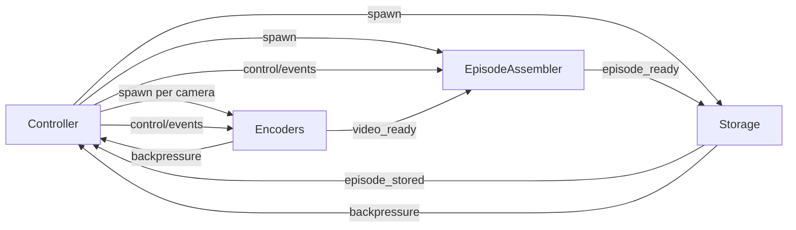

# Sprint 4B + Sprint 5

Build the remaining recording pipeline on top of the already-implemented standalone encoder: first finish Sprint 4 by integrating encoders into `rollio collect`, then implement Sprint 5 with an asynchronous Episode Assembler and local Storage backend. Keep the current Part A codec model authoritative for this slice and defer `ffv1`/`mjpeg` parity work. For encoded payload handoff, implement `file` as the only active mode in Sprint 4/5: encoders read raw frames from `iceoryx2`, write encoded artifacts into a configurable transient area that defaults to ramdisk but may point at normal disk, the assembler consumes those files plus buffered robot/action data to build a staged LeRobot episode, and Storage persists the staged episode into the final dataset root. Keep the encoder/assembler boundary abstract enough that a future `iceoryx2` encoded-stream mode can be added without redesigning Controller lifecycle or episode bookkeeping, and keep the storage boundary backend-neutral so `http` upload and `s3` can be added later without changing assembler semantics.

## Runtime Contracts And IPC

- Extend [rollio-types/src/config.rs](/home/tb5z035i/workspace/data-collect/rollio-ng/rollio-types/src/config.rs) with the missing runtime/config surface for Sprint 5. Keep the existing top-level `[encoder]` and `[storage]` config stable, add `storage.queue_size`, and introduce a small `[assembler]` block for `missing_video_timeout_ms` plus a configurable transient `staging_dir` that defaults to a ramdisk-backed path such as `/dev/shm/rollio` on Linux but may also point at a normal filesystem path.
- Add an explicit encoded-handoff setting or internal runtime abstraction rooted in `file` mode for Sprint 4/5. Whether this is exposed as config now or kept as an internal enum, the immediate implementation should only activate `file`; `iceoryx2` should be treated as a reserved future mode rather than part of the current delivery.
- Add derived runtime-config helpers on `Config` in [rollio-types/src/config.rs](/home/tb5z035i/workspace/data-collect/rollio-ng/rollio-types/src/config.rs) so [controller/src/collect.rs](/home/tb5z035i/workspace/data-collect/rollio-ng/controller/src/collect.rs) can keep using the existing `--config-inline` child-spawn pattern for encoders, assembler, and storage.
- Extend [rollio-types/src/messages.rs](/home/tb5z035i/workspace/data-collect/rollio-ng/rollio-types/src/messages.rs) and [rollio-bus/src/lib.rs](/home/tb5z035i/workspace/data-collect/rollio-ng/rollio-bus/src/lib.rs) with the missing Sprint 5 IPC: an explicit assembler-to-storage handoff message such as `EpisodeReady` and a storage-to-controller confirmation such as `EpisodeStored`. Keep `VideoReady` and `BackpressureEvent` unchanged for this sprint and defer richer artifact typing.
- Make the heavy handoff explicitly file-based for the current implementation: `VideoReady.file_path` should reference encoder-produced transient artifacts under the staging root, `EpisodeReady` should point Storage at a fully staged episode directory, and Storage should own the FIFO queue for these ready-to-persist episode directories. Keep this boundary modular so a future `iceoryx2` chunk-stream transport can reuse the same episode-level coordination logic.
- Keep the storage request shape backend-neutral rather than local-filesystem-specific. `EpisodeReady` should describe a staged episode payload that can be moved locally now, uploaded over `http` later, or pushed to `s3` later without requiring the assembler to know which backend is active.

## Finish Sprint 4 Integration

- Reuse the child-spec assembly already in [controller/src/collect.rs](/home/tb5z035i/workspace/data-collect/rollio-ng/controller/src/collect.rs) to spawn one `rollio-encoder` process per camera, using the already-implemented `EncoderRuntimeConfig` from [rollio-types/src/config.rs](/home/tb5z035i/workspace/data-collect/rollio-ng/rollio-types/src/config.rs). Derive each encoder `output_dir` from the configurable transient staging root so encoded camera artifacts land on ramdisk by default but can be redirected to normal disk when desired.
- Extend controller IPC in [controller/src/collect.rs](/home/tb5z035i/workspace/data-collect/rollio-ng/controller/src/collect.rs) to subscribe to encoder and storage backpressure. When any pipeline component reports pressure, reject `EpisodeCommand::Start` until the pipeline is healthy again; keep stop/keep/discard behavior unchanged for an already-recording episode.
- Add focused controller tests for encoder child-spec generation, backpressure-gated `Start`, and the Sprint 4 smoke path using [config/config.pseudo-teleop.toml](/home/tb5z035i/workspace/data-collect/rollio-ng/config/config.pseudo-teleop.toml): `rollio collect` should produce two playable artifacts from the two pseudo cameras. Include at least one config-path test that uses a normal disk staging directory so ramdisk is the default, not the only supported deployment.

## Implement Episode Assembler

- Replace the stub entrypoint in [episode-assembler/src/main.rs](/home/tb5z035i/workspace/data-collect/rollio-ng/episode-assembler/src/main.rs) with a small module set for IPC subscription, episode buffering, resampling, metadata writing, and LeRobot layout generation. Add the missing dependencies in [episode-assembler/Cargo.toml](/home/tb5z035i/workspace/data-collect/rollio-ng/episode-assembler/Cargo.toml) for Parquet/JSON/temp-dir work.
- Model assembler state per `episode_index`, not as a single global buffer, so the user can start episode `N+1` immediately after keeping episode `N` while episode `N` is still waiting for `VideoReady` or storage. Maintain one active recording plus a map of frozen pending episodes.
- Subscribe to all robot state topics and follower command topics derived from [rollio-types/src/config.rs](/home/tb5z035i/workspace/data-collect/rollio-ng/rollio-types/src/config.rs), plus `control/events` and `encoder/video-ready`. Buffer state/action samples between `RecordingStart` and `RecordingStop`, freeze on stop, then assemble only after all expected camera artifacts arrive from the transient encoder output directories.
- Generate a staged LeRobot v2.1 episode directory under the configurable `assembler.staging_dir` with resampled state rows at `episode.fps`, an `action` column from follower commands, `meta/info.json` containing feature metadata plus the embedded full TOML config, and chunked file paths derived from `episode.chunk_size`. On `EpisodeDiscard`, drop buffers and any staged output. On missing videos, wait until `missing_video_timeout_ms`, log, and discard.

## Implement Local Storage And Async Counting

- Replace the stub entrypoint in [storage/src/main.rs](/home/tb5z035i/workspace/data-collect/rollio-ng/storage/src/main.rs) with a queue-based local backend that accepts `EpisodeReady`, serializes ready episode directories through a storage-owned FIFO, moves or copies the staged episode directory from ramdisk-backed transient storage into `storage.output_path`, emits `EpisodeStored`, and publishes `BackpressureEvent` when its queue fills.
- Update [controller/src/episode.rs](/home/tb5z035i/workspace/data-collect/rollio-ng/controller/src/episode.rs) and [controller/src/collect.rs](/home/tb5z035i/workspace/data-collect/rollio-ng/controller/src/collect.rs) so `Keep` still returns the UI to `Idle` immediately, but `EpisodeStatus.episode_count` advances only when `EpisodeStored` arrives. That matches the background-finalization behavior documented in [design/components.md](/home/tb5z035i/workspace/data-collect/rollio-ng/design/components.md).
- Keep the Visualizer/UI protocol shape stable unless blocked-start behavior needs an explicit user-visible reason. If the new stored-count semantics require follow-up adjustments, the likely touchpoints are [visualizer/src/protocol.rs](/home/tb5z035i/workspace/data-collect/rollio-ng/visualizer/src/protocol.rs) and [ui/terminal/src/App.tsx](/home/tb5z035i/workspace/data-collect/rollio-ng/ui/terminal/src/App.tsx).
- Preserve a backend abstraction in the Storage implementation even though Sprint 5 only activates local persistence. The immediate code path should target `local`, but runtime/config/types should not block future `http` upload or `s3` implementations.

## Verification

- Add shared-type/config coverage in [rollio-types/tests/config.rs](/home/tb5z035i/workspace/data-collect/rollio-ng/rollio-types/tests/config.rs) for the new config knobs and message shapes.
- Add controller tests for encoder spawning, backpressure gating, and stored-count semantics.
- Add `rollio-episode-assembler` unit tests for buffering, resampling, action capture, metadata, directory layout, discard, and missing-video timeout.
- Add `rollio-storage` unit tests for local move/copy, `EpisodeStored`, and queue backpressure.
- Finish with the Sprint 5 pseudo-device smoke path: three kept episodes plus one discarded episode should produce a valid LeRobot v2.1 tree under the configured output directory, with optional validation through a small LeRobot Python loader after the automated smoke passes.
- Preserve a clear future extension point for stream-oriented backends such as a single-file assembler: encoded handoff remains file-based in Sprint 4/5, but the runtime contract should be factored so a later `iceoryx2` encoded-stream mode can be added without rewriting the controller-facing lifecycle or storage completion flow.
- Keep future verification in mind for post-Sprint-5 storage backends: the Storage API should make it straightforward to add backend-specific tests later for `http` upload integrity and `s3` object-layout correctness without changing the assembler-facing contract.
